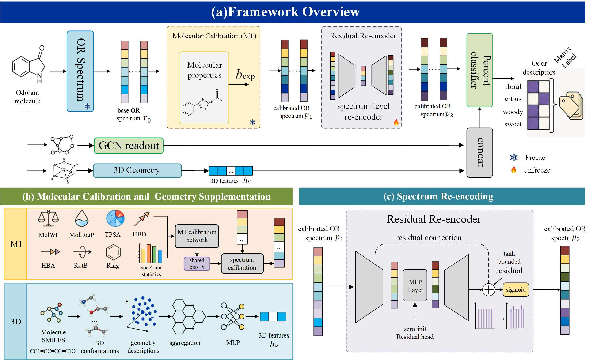
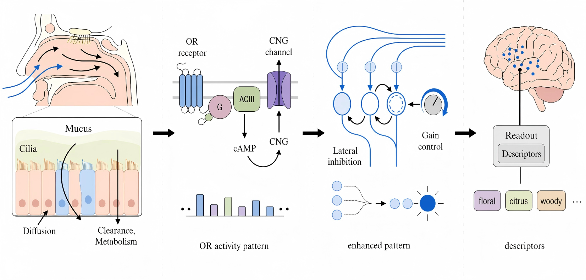

# Full CaReOR

CaReOR predicts odor descriptors by making the receptor space an explicit part of the model. Instead of reading percept labels directly from molecular structure, the full route starts from a fixed olfactory receptor (OR) activity spectrum, calibrates that spectrum with molecule-level context, adds 3D geometric cues, and then refines the receptor code before the final classifier.

This package contains the code and data assets for the full CaReOR setting reported in the paper:

| Model | Test ROC-AUC | Test PR-AUC |
|---|---:|---:|
| Full CaReOR | 0.8779 +/- 0.0002 | 0.2998 +/- 0.0020 |



## Concept

The model is built around a simple assumption: the OR activity pattern is a useful intermediate level between molecule and percept. A molecular graph tells us about chemical structure, but the receptor spectrum gives a more direct view of how that molecule may be organized before perceptual readout. CaReOR keeps this receptor-side representation visible and processes it in a controlled way.



The full model adds three operations around the OR spectrum:

| Component | Role |
|---|---|
| Molecular Calibration | Estimates a molecule-level spectral bias from RDKit descriptors and OR-spectrum statistics. |
| Geometry Supplementation | Adds conformer-derived 3D information that is not fully captured by the graph or OR spectrum alone. |
| Spectrum Re-encoding | Refines the calibrated receptor spectrum with a small residual module before descriptor prediction. |

The framework figure follows this organization: a molecular graph branch runs in parallel with the OR-spectrum branch; Molecular Calibration adjusts the receptor spectrum; the 3D branch supplies geometric context; Spectrum Re-encoding refines the calibrated spectrum; and the classifier reads out odor descriptors from the fused representation.

## Pipeline

At a high level, the full run follows this path:

```text
odorant molecule
  -> molecular graph representation
  -> fixed OR activity spectrum
  -> molecular calibration
  -> residual spectrum re-encoding
  -> fusion with aggregated 3D geometry
  -> multi-label odor descriptor prediction
```

The main tensors used by the full route are:

| Representation | Shape | Description |
|---|---:|---|
| Base OR logits | `[N, 1237]` | Fixed receptor-side activity spectrum. |
| RDKit descriptors | `[N, 7]` | Molecular weight, MolLogP, TPSA, HBD, HBA, RotB, and Ring count. |
| OR-spectrum summary | `[N, 8]` | Mean, standard deviation, selected quantiles, maximum response, top-5 mean, and top-10 mean. |
| Molecular calibration input | `[N, 15]` | Concatenation of RDKit descriptors and OR-spectrum summary. |
| Aggregated 3D features | `[N, 42]` | Conformer-level geometry and energy statistics, plus validity information. |
| Odor descriptor logits | `[N, 152]` | Multi-label output over odor descriptors. |

## Model Details

Molecular Calibration predicts one scalar bias per molecule and adds it to all OR channels. This keeps the receptor-channel identities intact while allowing the model to shift the overall activation tendency of the spectrum. The calibration network uses seven RDKit descriptors together with eight summary statistics from the base OR logits.

Geometry Supplementation brings in 3D context from RDKit conformers. Conformers are generated with ETKDG, optimized with MMFF94s when possible, and optimized with UFF as a fallback. The resulting conformers are summarized with size, shape, inertial, geometry, and energy statistics. If no valid conformer is available, the numerical features are filled with zeros and the validity flag records that case.

Spectrum Re-encoding uses a lightweight residual module to refine the calibrated OR spectrum. The residual is bounded before it is injected into logit space, and the module is initialized to preserve the calibrated spectrum at the start of training. This gives the classifier a trainable receptor-code adjustment without discarding the calibrated OR representation.

The final classifier reads from the molecular graph representation, the refined OR representation, and the projected 3D geometry feature.

## Dataset And Labels

The processed GoodScents-Leffingwell dataset combines odor annotations from GoodScents and Leffingwell. Molecules are standardized with canonical SMILES, duplicate structures are merged, and descriptor names are normalized across the two sources.

Missing annotations are treated as unobserved entries, not as negative labels. Training and evaluation use a binary label mask, so only observed entries contribute to the loss and metrics. Descriptors with fewer than 30 positive molecules are removed to avoid extremely sparse labels and unstable metric computation.

After preprocessing, the task contains 5862 molecules and 152 odor descriptors. Each molecule is represented by a molecular graph, a masked multi-label descriptor vector, and a fixed 1237-dimensional OR spectrum.

## Experiments

The full route uses a GCN molecular encoder, the fixed OR spectrum, Molecular Calibration, aggregated 3D features, Spectrum Re-encoding, and a multi-label classifier. Checkpoint selection is based on validation ROC-AUC. Test ROC-AUC and PR-AUC are macro-averaged over labels that are valid for evaluation.

The main ablation starts from a graph-only model and then adds the receptor-side components step by step:

| Setting | Test ROC-AUC | Test PR-AUC |
|---|---:|---:|
| GCN | 0.8709 +/- 0.0021 | 0.2747 +/- 0.0348 |
| GCN + OR Spectrum | 0.8717 +/- 0.0020 | 0.2935 +/- 0.0044 |
| GCN + OR Spectrum + Calibration | 0.8726 +/- 0.0042 | 0.3005 +/- 0.0058 |
| GCN + OR Spectrum + Calibration + 3D | 0.8737 +/- 0.0066 | 0.2990 +/- 0.0079 |
| Full CaReOR | 0.8779 +/- 0.0002 | 0.2998 +/- 0.0020 |

The ablation suggests that the OR spectrum is useful even before calibration, that Molecular Calibration improves how the spectrum is used, that 3D features add complementary molecular context, and that Spectrum Re-encoding gives the largest final gain in ROC-AUC.

## Code Contents

| Item | Purpose |
|---|---|
| `classification_OR_feat_ESM.py` | Main training and evaluation entry for the full route. |
| `classification_ESM.py` | Molecular graph classification support code. |
| `gcn_or_predictor.py` | GCN-OR model components. |
| `utils.py` | Dataset splitting, metrics, and shared utilities. |
| `m1_vnew.py` | Molecular Calibration, Spectrum Re-encoding, and fusion modules. |
| `gslf_m1_dataset.py` | Dataset wrapper for calibration and receptor-space features. |
| `build_gslf_3d_features.py` | Offline construction of aggregated 3D molecular features. |
| `build_gslf_or_logits_sharded.py` | Offline construction of OR-spectrum cache. |
| `train_m1_vnew_gslf.py` | Standalone training utility for calibration modules. |
| `eval_m1_vnew_gslf.py` | Standalone evaluation utility for calibration modules. |
| `m1_vnew_common.py` | Shared helpers for calibration training and evaluation. |

## Required Assets

The package includes the following assets:

| Asset | Purpose |
|---|---|
| GS-LF percept dataset | Molecules, descriptor labels, and missing-label mask. |
| Cached OR logits | Fixed 1237-dimensional receptor spectrum used by the main route. |
| Aggregated 3D feature table | Precomputed conformer-derived geometry features. |
| RDKit descriptor table | Seven molecular descriptors used by Molecular Calibration. |
| M2OR metadata | Receptor-side metadata required when regenerating OR spectra. |

## Running

Create the environment from the conda configuration, enter the code directory, and run the main script. The full-route command uses the included GS-LF data, OR spectra, RDKit descriptor table, and 3D feature table. The output directory will contain the selected checkpoint, final metrics, per-epoch summaries, and best-validation summaries.

```bash
cd NIPS/mian-code
python classification_OR_feat_ESM.py \
  --or_logits_path data/datasets/full_1237_ORs_logits.pt \
  --morvalue_csv ../morvalue.csv \
  --three_d_feat_path runs/three_d/gslf_3d_features.csv \
  -rp classification_results/full_careor
```

The same script can also be pointed to a different OR-logit cache, descriptor table, 3D feature table, or output directory.