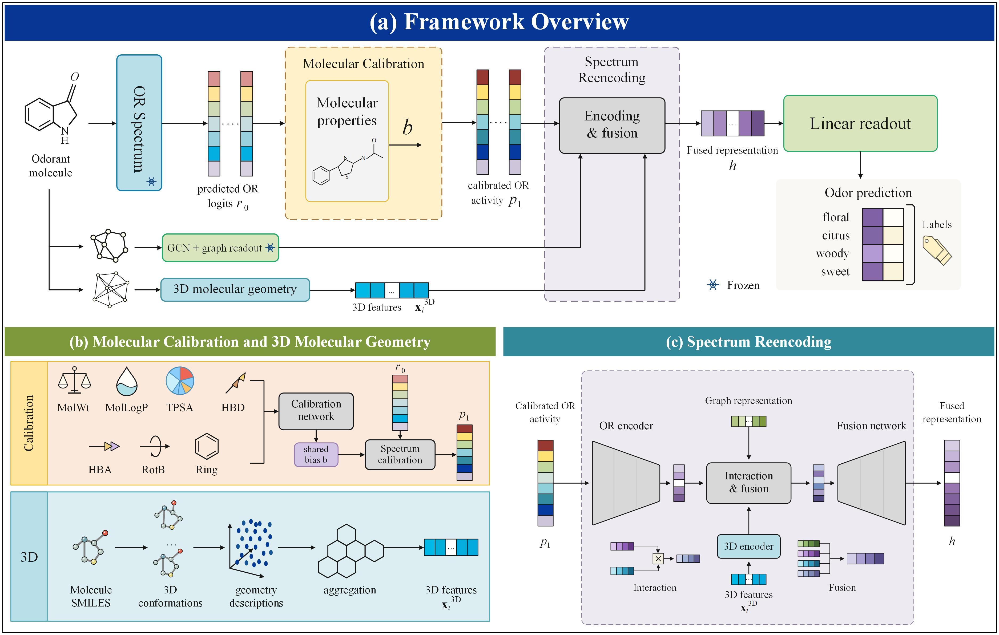
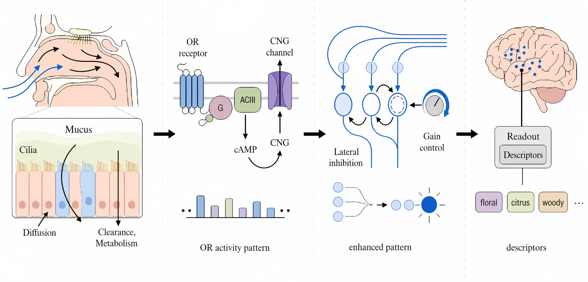

# Full CaReOR

[中文说明](README_ZH.md)

CaReOR predicts odor descriptors using a predicted olfactory receptor (OR) activity spectrum as an intermediate representation. Molecular Calibration adjusts the overall activation tendency of this spectrum using molecular descriptors. The calibrated spectrum is then encoded and integrated with molecular graph and aggregated 3D geometry representations before perceptual readout.

The full model obtains the following test results. Values are means ± population standard deviations over four training seeds.

| Model | Test ROC-AUC | Test PR-AUC |
| --- | ---: | ---: |
| Full CaReOR | 0.8863 ± 0.0012 | 0.3217 ± 0.0061 |



## Concept

The model is motivated by the staged organization of olfactory processing. Molecular structure and predicted receptor activity provide complementary descriptions of an odorant. CaReOR introduces an explicit processing stage between receptor activity prediction and perceptual readout, allowing molecule-level calibration and receptor-side representation learning to be examined separately from the final odor predictions.



| Component | Role |
| --- | --- |
| Molecular Calibration (M1) | Estimates a molecule-conditioned bias shared by all receptor logits. |
| Geometry Supplementation | Provides complementary molecular information from aggregated conformer descriptors. |
| Spectrum Reencoding (M3) | Encodes the calibrated OR spectrum and geometry, constructs their interaction, and combines them with graph features. |

M1 operates at the molecule level: it adjusts the common response tendency while preserving receptor-logit differences and receptor ordering. M3 learns the downstream representations used for perceptual prediction. The predicted OR spectrum serves as a model intermediate; it is not a direct measurement of receptor activation in vivo.

## Pipeline

Molecular Calibration adjusts the predicted receptor responses using seven molecular descriptors. Spectrum Reencoding then integrates the calibrated receptor representation, aggregated 3D geometry, and molecular graph representation into a latent representation for linear perceptual readout.

| Representation | Shape | Description |
| --- | ---: | --- |
| Molecular graph representation | `[N, 512]` | Weighted-sum and max graph readout. |
| Base OR logits | `[N, 1237]` | Fixed receptor-predictor outputs. |
| Molecular descriptors | `[N, 7]` | MW, MolLogP, TPSA, HBD, HBA, RotB, and Ring count. |
| Shared calibration bias | `[N, 1]` | One bounded scalar per molecule. |
| Aggregated geometry | `[N, 42]` | 41 numerical features and one validity flag. |
| OR and geometry codes | `[N, 64]` each | Learned by the two encoders inside M3. |
| Fusion input | `[N, 704]` | Concatenation of `g`, `u`, `v`, and `u * v`. |
| Fused representation | `[N, 404]` | Output of the M3 fusion network. |
| Odor descriptor logits | `[N, 152]` | Multi-label predictions. |

## Model Details

**Molecular Calibration.** M1 uses seven physicochemical descriptors to estimate a molecule-dependent adjustment of the overall receptor activation tendency. A `7→96→96→1` network with LayerNorm, GELU, and dropout predicts a shared bias, `b = 0.5 * tanh(f(x))`. The last linear layer is zero-initialized, so calibration starts as an identity mapping. Applying `r1 = r0 + b` preserves pairwise receptor-logit differences and receptor ordering within each molecule.

**Geometry Supplementation.** RDKit conformers are generated with ETKDG and optimized with MMFF94s, with UFF as a fallback. Size, shape, inertia, energy, and conformer-count information are aggregated into 41 numerical features; a validity flag forms the 42nd feature. Numerical geometry features are standardized using valid training molecules. Molecules without valid geometry receive zero numerical features and a zero validity flag. Inside the full model, a `42→64→64` encoder with LayerNorm and GELU produces the geometry representation.

**Spectrum Reencoding.** The calibrated OR probabilities are encoded by a `1237→64` projection with LayerNorm and GELU. M3 combines the OR code, geometry code, their element-wise interaction, and the graph representation. A `704→404→404` fusion network with LayerNorm, GELU, and dropout produces the perceptual representation, followed by a linear `404→152` readout. This learned representation captures cross-receptor combinations and molecular context; its coordinates have no predefined one-to-one correspondence with receptor identities.

## Dataset And Labels

The provided preprocessed GoodScents–Leffingwell (GS-LF) dataset contains 5,862 molecules and 152 odor descriptors. Canonical SMILES are used for graph construction and feature alignment. Missing annotations are treated as unobserved entries and excluded through a binary label mask in both training and evaluation.

Experiments use a fixed 8:1:1 training/validation/test partition and four training seeds: 7, 32, 42, and 63. The reported full-model configuration uses its associated precomputed seven-property inputs. In the corresponding calibration ablations, the same properties are recomputed with RDKit and normalized using training-split statistics. Geometry normalization uses training molecules with valid conformers. The fixed OR spectrum has 1,237 channels, with molecule and receptor ordering kept consistent across configurations.

## Experiments

Checkpoints are selected by validation ROC-AUC. Test ROC-AUC and trapezoidal PR-AUC are macro-averaged over evaluable labels and reported as means ± population standard deviations across four runs.

### Comparison with Other Methods

CaReOR is compared with conventional machine learning and neural odor-prediction methods on the processed GS-LF dataset using the same fixed data partition. The following results correspond to the main comparison in the TNNLS submission.

| Method | Test ROC-AUC | Test PR-AUC |
| --- | ---: | ---: |
| GB | 0.8438 ± 0.0008 | 0.2898 ± 0.0012 |
| KNN | 0.6666 ± 0.0000 | 0.1534 ± 0.0000 |
| RF | 0.7956 ± 0.0029 | 0.2574 ± 0.0017 |
| SVM | 0.7985 ± 0.0011 | 0.2226 ± 0.0010 |
| MolFormer | 0.8447 ± 0.0019 | 0.2469 ± 0.0060 |
| Mol-PECO | 0.8595 ± 0.0035 | 0.2682 ± 0.0034 |
| LIFMCN | 0.8128 ± 0.0092 | 0.1905 ± 0.0050 |
| MPNN-POM | 0.8740 ± 0.0064 | 0.3162 ± 0.0054 |
| CaReOR | **0.8863 ± 0.0012** | **0.3217 ± 0.0061** |

CaReOR achieves the highest mean scores on both metrics. Relative to MPNN-POM, the strongest baseline in this table, the absolute improvements are 0.0123 in ROC-AUC and 0.0055 in PR-AUC, indicating improved discrimination and positive-label retrieval under sparse multilabel annotations.

### Component Comparison

The experiments examine the progressive incorporation of OR information, Molecular Calibration, and 3D geometry, followed by the complete CaReOR system. The first four configurations follow the baseline protocol; Full CaReOR uses the complete Spectrum Reencoding architecture and staged optimization.

| Setting | Test ROC-AUC | Test PR-AUC |
| --- | ---: | ---: |
| GCN | 0.8719 ± 0.0047 | 0.2966 ± 0.0060 |
| GCN + OR Spectrum | 0.8695 ± 0.0017 | 0.2906 ± 0.0058 |
| GCN + OR Spectrum + Molecular Calibration | 0.8722 ± 0.0019 | 0.2918 ± 0.0042 |
| GCN + OR Spectrum + Molecular Calibration + 3D | 0.8748 ± 0.0042 | 0.2936 ± 0.0053 |
| Full CaReOR | **0.8863 ± 0.0012** | **0.3217 ± 0.0061** |

Molecular Calibration and 3D geometry improve both mean metrics relative to the direct OR configuration. Full CaReOR achieves the highest mean ROC-AUC and PR-AUC in this system-level comparison.

### Generalization across Chemical Families

Generalization is evaluated under the fixed, label-blind chemical-cluster split (C0). Molecules are represented by chirality-aware, 2048-bit Morgan fingerprints with radius 2 and grouped by Butina clustering using a Tanimoto-distance cutoff of 0.6. Complete clusters are assigned to training, validation, and test subsets at approximately 80/10/10, keeping each cluster within a single subset. Odor labels are excluded from split construction. CaReOR is trained on this partition, with molecular-property and geometry normalization fitted to its training subset.

The tables compare CaReOR with MPNN-POM across 12 chemical families. Families may overlap, and each family's metrics use labels with both observed positive and negative samples. The Overall row is evaluated directly on all 586 test molecules and 150 evaluable labels. Each delta is CaReOR minus MPNN-POM; MPNN-POM values follow the four-decimal reference results reported in the manuscript.

**ROC-AUC across chemical families**

| Chemical family | Molecules | Evaluable labels | CaReOR ROC-AUC | MPNN-POM ROC-AUC | ΔROC |
| --- | ---: | ---: | ---: | ---: | ---: |
| Aromatic compounds | 237 | 123 | 0.8010 ± 0.0089 | 0.8039 ± 0.0047 | -0.0029 |
| Aromatic heterocycles | 37 | 67 | 0.8095 ± 0.0136 | 0.8189 ± 0.0123 | -0.0094 |
| Non-aromatic heterocycles | 61 | 73 | 0.8587 ± 0.0127 | 0.8560 ± 0.0054 | +0.0027 |
| Aliphatic alcohols | 74 | 90 | 0.8349 ± 0.0053 | 0.8343 ± 0.0075 | +0.0006 |
| Ethers | 150 | 107 | 0.8516 ± 0.0059 | 0.8534 ± 0.0054 | -0.0018 |
| Aldehydes | 30 | 51 | 0.8427 ± 0.0139 | 0.8170 ± 0.0152 | +0.0257 |
| Ketones | 70 | 87 | 0.7964 ± 0.0074 | 0.7888 ± 0.0101 | +0.0076 |
| Carboxylic acids | 22 | 28 | 0.8598 ± 0.0087 | 0.8656 ± 0.0278 | -0.0058 |
| Esters | 253 | 128 | 0.7969 ± 0.0063 | 0.7950 ± 0.0046 | +0.0019 |
| Amines | 34 | 47 | 0.8828 ± 0.0137 | 0.8601 ± 0.0205 | +0.0227 |
| Alkenes | 209 | 120 | 0.8077 ± 0.0020 | 0.7974 ± 0.0031 | +0.0103 |
| Sulfur-containing compounds | 64 | 72 | 0.7962 ± 0.0128 | 0.7704 ± 0.0041 | +0.0258 |
| **Overall** | **586** | **150** | **0.8573 ± 0.0031** | 0.8565 ± 0.0025 | **+0.0008** |

**PR-AUC across chemical families**

| Chemical family | Molecules | Evaluable labels | CaReOR PR-AUC | MPNN-POM PR-AUC | ΔPR |
| --- | ---: | ---: | ---: | ---: | ---: |
| Aromatic compounds | 237 | 123 | 0.2535 ± 0.0131 | 0.2441 ± 0.0108 | +0.0094 |
| Aromatic heterocycles | 37 | 67 | 0.3733 ± 0.0219 | 0.4151 ± 0.0275 | -0.0418 |
| Non-aromatic heterocycles | 61 | 73 | 0.4033 ± 0.0298 | 0.3521 ± 0.0172 | +0.0512 |
| Aliphatic alcohols | 74 | 90 | 0.3338 ± 0.0067 | 0.3008 ± 0.0206 | +0.0330 |
| Ethers | 150 | 107 | 0.3431 ± 0.0127 | 0.2958 ± 0.0099 | +0.0473 |
| Aldehydes | 30 | 51 | 0.4862 ± 0.0251 | 0.4592 ± 0.0220 | +0.0270 |
| Ketones | 70 | 87 | 0.3570 ± 0.0075 | 0.3009 ± 0.0058 | +0.0561 |
| Carboxylic acids | 22 | 28 | 0.4394 ± 0.0477 | 0.4537 ± 0.0483 | -0.0143 |
| Esters | 253 | 128 | 0.2687 ± 0.0050 | 0.2226 ± 0.0153 | +0.0461 |
| Amines | 34 | 47 | 0.4771 ± 0.0261 | 0.4072 ± 0.0368 | +0.0699 |
| Alkenes | 209 | 120 | 0.2913 ± 0.0151 | 0.2429 ± 0.0028 | +0.0484 |
| Sulfur-containing compounds | 64 | 72 | 0.3161 ± 0.0058 | 0.2584 ± 0.0128 | +0.0577 |
| **Overall** | **586** | **150** | **0.2916 ± 0.0010** | 0.2496 ± 0.0008 | **+0.0420** |

Under this chemical distribution shift, overall ROC-AUC is close between the two methods, while CaReOR improves overall PR-AUC by 0.0420. CaReOR achieves higher mean ROC-AUC in 8 of 12 families and higher mean PR-AUC in 10. The broad PR-AUC gains support improved positive-label retrieval across multiple structural groups; aromatic heterocycles and carboxylic acids remain challenging, with lower means on both metrics. These comparisons describe the reported mean performance and do not establish paired statistical significance.

## Code Contents

Paths below are relative to `mian-code/`. `main.py` provides a single entry for training and checkpoint evaluation across the five component configurations. The `real/` package contains the model, data processing, and shared tools. The method-comparison and chemical-family tables summarize the manuscript experiments.

| Item | Purpose |
| --- | --- |
| `main.py` | Unified training, model checking, and checkpoint evaluation entry. |
| `gcn_or_predictor.py` | Upstream graph/receptor prediction components. |
| `utils.py` | Dataset splitting, batching, metrics, and shared utilities. |
| `real/models/careor.py` | Molecular Calibration, M3, and full-model assembly. |
| `real/data/gslf_dataset.py` | Feature alignment, preprocessing, and dataset wrappers. |
| `real/tools/training.py` | Training schedules, checkpoint selection, and prediction evaluation. |
| `real/tools/reporting.py` | Per-seed metrics and aggregate result tables. |
| `real/tools/runtime.py` | Runtime checks, fixed data splits, and graph-model construction. |
| `real/tools/losses.py` | Training objectives and label statistics. |
| `real/tools/restore_assets.py` | Restoration and checksum verification of packaged data assets. |
| `real/tools/build_gslf_3d_features.py` | Offline construction of aggregated 3D features. |
| `real/tools/build_gslf_or_logits_sharded.py` | Offline generation and merging of OR-logit shards. |

## Required Assets

The release includes the data and model resources below. Large cached inputs are stored as lossless parts of at most 6 MiB, with checksums in `ASSETS.json`. The main entry automatically reconstructs and verifies them.

| Asset | Purpose |
| --- | --- |
| GS-LF percept dataset | Molecular structures and odor annotations used to construct labels and masks. |
| Cached OR logits | Fixed `[5862, 1237]` receptor-predictor outputs. |
| Aggregated 3D feature table | Raw conformer-derived geometry values and validity information. |
| Molecular descriptor table | Seven-property inputs aligned to dataset molecules and the reported configuration. |
| Fixed graph weights | Graph encoder and graph readout used by the submitted full model. |
| M2OR metadata | Receptor-side information used when regenerating OR spectra. |

The supplied OR cache supports the main perceptual training route. Regenerating the cache additionally requires the upstream receptor-predictor checkpoint and sequence-embedding resources. Reproduction of the submitted full-model configuration also requires its fixed graph encoder and graph readout weights.

## Running

The environment files target Linux with Python 3.8.16, PyTorch 2.0.1/CUDA 11.8, DGL 1.1.0/CUDA 11.8, DGLLife 0.3.2, and RDKit 2023.03.1. Create and activate the main environment:

```bash
cd mian-code
conda env create -f environment.yml
conda activate careor
export PYTHONNOUSERSITE=1
export DGLBACKEND=pytorch
export LD_LIBRARY_PATH="$CONDA_PREFIX/lib:$(python -c 'import os, torch; print(os.path.join(os.path.dirname(torch.__file__), "lib"))')${LD_LIBRARY_PATH:+:$LD_LIBRARY_PATH}"
```

Verify the supplied assets and model interfaces, then run a short smoke check:

```bash
python real/tools/restore_assets.py --verify
python main.py --check
python main.py --smoke --seeds 7 -rp classification_results/smoke
```

Train Full CaReOR with four seeds:

```bash
python main.py --strict-runtime --seeds 7,32,42,63 -rp classification_results/full_careor
```

Run the five component configurations or evaluate a selected checkpoint:

```bash
python main.py --strict-runtime --all-configurations --seeds 7,32,42,63 -rp classification_results/components
python main.py --evaluate classification_results/full_careor/full__seed_7/model.pth
```

Use `--device cpu` for CPU checks and a new output directory for each run. Outputs include selected checkpoints, preprocessing records, training histories, per-seed predictions, and metric summaries. Input paths can be specified using `--or_logits_path`, `--morvalue_csv`, `--three_d_feat_path`, and `--backbone_path`; the submitted inputs are checksum-verified. Reported tables are reference results; smoke runs only verify execution.

The optional `olfaction.yml` environment supports OR-spectrum regeneration. Its sequence-cache and shard commands require the upstream receptor-predictor checkpoint and ESM resources. Use `python real/tools/build_gslf_or_logits_sharded.py --help` for the offline helper.
